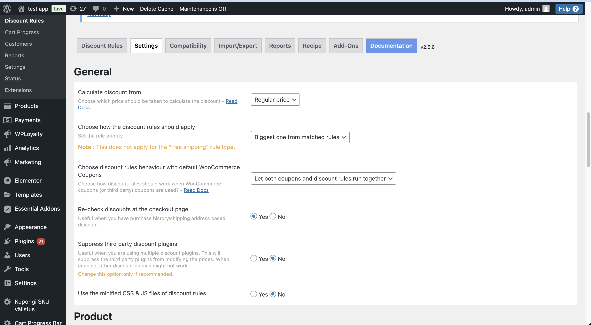
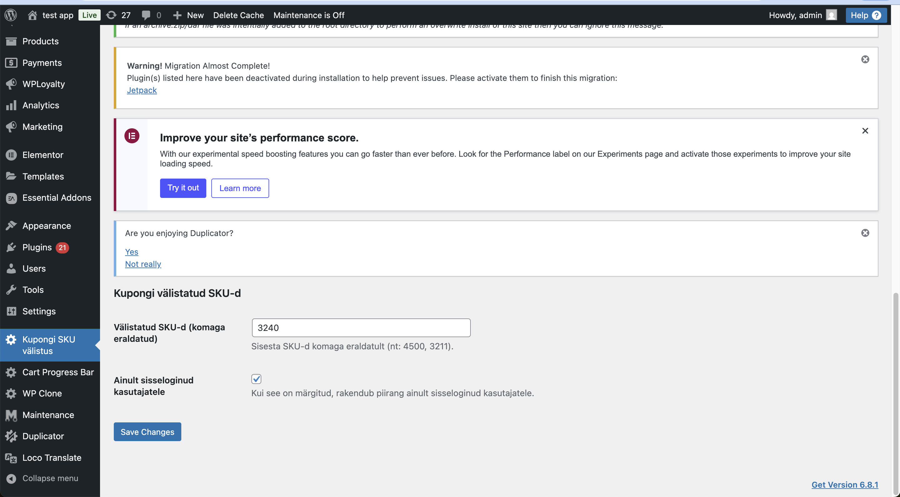
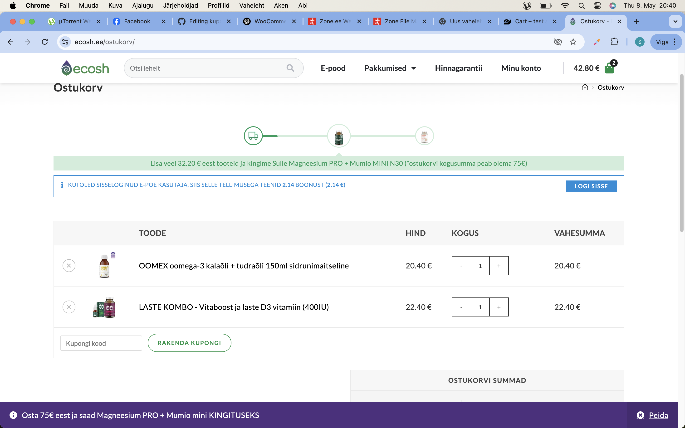
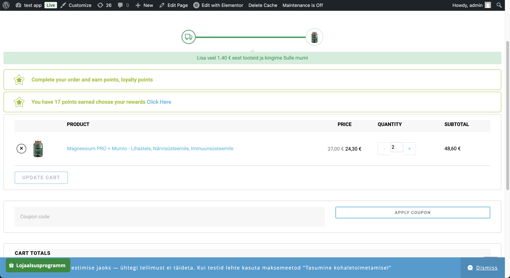

Praegune lahendus lükkab kogu ostukorvi ulatuses kupongi tagasi kui ostukorvis on vähemalt üks toode mille reeglid on tehtud discount rulesiga  
Miks “Exclude sale items” ei aita? 
Discount Rules ei salvesta sale_price-i. Plugin arvutab soodushinna jooksvalt, ent ei täida WooCommerce’i standardset sale_price meta-välja. 
Toode ei ole faktiliselt “sale”. Kuna sale_price on tühi, siis product->is_on_sale() tagastab false ja WooCommerce peab toodet täishinnaliseks. 
Kupong rakendub ikkagi. “Exclude sale items” ei leia ühtegi tõelist “sale” toodet, mistõttu –15 % kupong lisandub ka –40 % või mis iganes Discount Rules reeglitele juhul kui oleks seadetes pandud "let both coupons and discount rules run together". 
Hetkel on seadetes aktiveeritud “Disable coupons” (Discount Rules will work) 
on tahtlikult valitud, et ei rakenduks topelt soodustused. 
See seade annab Discount Rules’ile käsu peatada kogu kupongi-loogika hetkel, kui Discount Rules reeglid kehtivad. 
See tähendab see, et kui ostukorvis on vähemalt üks DR-iga soodustatud toode, käitub plugin nii, nagu setting ütleb ühesõnaga blokeerib  kõik kupongi-kontrollid ja tagastab vea (“invalid coupon” või “cannot apply coupon”).

# lahendus
# Kupongi sku põhine välistus plugin

Discount rulesis tuleb panna settingutes
"Let both coupons and discount rules run together"

Aktiveerida plugin 

Mine menüüsse “Kupongi SKU välistus”.

Kui soovid, et piirang kehtiks ainult sisseloginud kasutajatele, märgi linnuke kui mõlemale siis ei ole vaja märkida.
Hinnagarantii reegli puhul peaks kupongi kasutamine olema keelatud ainult sisseloginud kasutajatele, kuna neile on juba antud 40% soodustus ning lisasoodustus ei tohiks rakenduda. Praegune lahendus keelab kupongi rakendamise kogu ostukorvile, kui ostukorvis on vähemalt üks reeglile vastav toode, mistõttu ei saa kupongi üldse kasutada.
Sisselogimata kasutajad saavad kupongi kasutada, kuna neile kuvatakse toote täishind.
Kui toode on SKU-põhiselt piiratud, ei rakendu soodustus sellele tootele; teistele täishinnaga toodetele rakendub soodustushind kupongi seadistuste kohaselt.

# Plugina kood "source" kasutas.

# Note hetkel Ecoshi epoes kassas väga selgelt pole aru saada kas toode on soodushinnaga kuna ei ole hind läbi kriipsutatud võiks ostukorvis kuvada siis oleks kliendil arusaadavam miks kupong osadele toodetele soodustust ei rakendu, hetkel visuaalselt veits keeruline aru saaada kas on tootel soodushind või mitte pilt ostukorvist toodetest millel mõlemal soodushind:  

Võiks kuvada nii:

